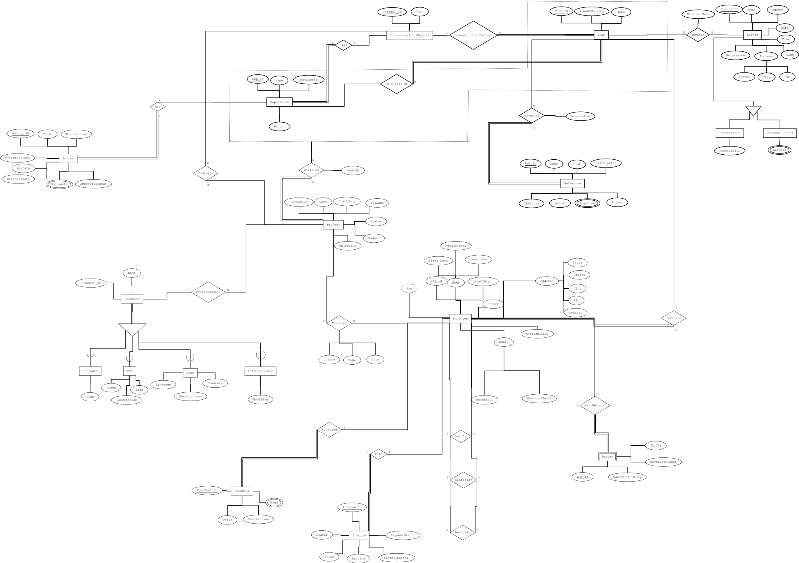

🌐 CollabNet
A comprehensive DBMS project to power organizational collaboration — enabling companies to manage employees, projects, events, and policies efficiently.

📚 Project Overview
CollabNet is a relational database project designed for modern organizational management. It provides a centralized system for HR operations, project tracking, event coordination, and policy compliance through structured, normalized data.

It serves as a centralized system for:

👥 Employee Management to handle staff hierarchies, team assignments, and performance tracking
🏢 Departments & Teams to organize workforces with budgets, leadership, and communication channels
📊 Project Lifecycle to track budgets, timelines, resources, and deliverables across teams
📅 Event Coordination for company meetings, conferences, product launches, and team activities
📋 Policy Management with approval workflows, document control, and compliance tracking
📚 Resource Library for PDFs, code repositories, documentation, and reference materials
"Our objective was to create a scalable organizational database that supports real-world enterprise features like employee hierarchies, project tracking, and policy compliance."

🛠️ Features
🧱 Fully normalized schema (up to BCNF) with 26+ tables
📄 Comprehensive DDL with employee, project, event, and policy modules
⚙️ Referential integrity through foreign keys and hierarchical relationships
🔍 Sample data with 20+ records per entity for realistic testing
📊 ER Diagram & Relational Schema visualization
🧪 Tested on PostgreSQL with global employee distribution

## ER Diagram  

Here's the system ER diagram showing entity relationships:

  

## Relational Schema  

Here's the system relational diagram:

  

🧾 Use Case Highlights
👥 Application Users
Employees & Managers – Create profiles, track performance, manage teams, and coordinate projects.
Departments & Teams – Organize workflows, allocate budgets, and maintain communication channels.
HR & Admin – Handle recruitment, policy compliance, event planning, and resource management.

🔎 Core Functionalities
Employee Registration & Hierarchy – Unique employee ID with personal details, team assignments, reporting structure.
Department & Team Structure – Organizational units with budgets, leadership, and communication channels.
Project Management – Complete lifecycle tracking with budgets, timelines, resources, and team assignments.
Event Coordination – Company events, meetings, conferences with team invitations and scheduling.
Policy & Compliance – Document management, approval workflows, and compliance tracking.
Resource Management – Multi-type resources (PDFs, Git repos, software) with project linkage.
Communication Integration – Multi-platform channels (Slack, Teams, Email) for team collaboration.

## Setup

```bash
# Create schema
psql -U username -d database -f DDL_Script.sql

# Load sample data  
psql -U username -d database -f Data_Insertion_Script.sql
```

